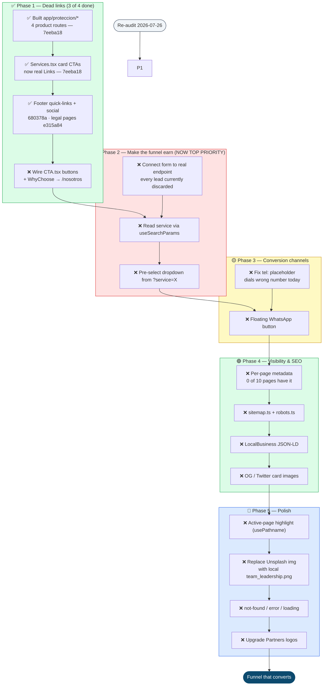

# Techaus Navigation & Visibility Improvement Workflow

Recommended remediation sequence to fix the click-through experience.
Author: Enrique Ruibal
Created: 2026-05-31
**Last re-audited: 2026-07-26 @ `e315a84`**

---

## Status at a glance

| Metric | Original audit | Now | Δ |
| --- | --- | --- | --- |
| Live routes | 4 | **10** | ▲ 6 |
| Broken routes (404) | 4 | **0** | ▼ 4 |
| Dead `href="#"` links (rendered) | 14 | **0** | ▼ 14 |
| Inert buttons (no handler) | 2 | **2** | — |
| Leads persisted | 0 | **0** | — |
| Pages with own `metadata` | 0 / 4 | **0 / 10** | ▼ worse |

**Phase 1 is 3/4 complete. Phases 2–5 are untouched.**

Three commits closed most of the red tier:

- `7eeba18` — built `app/proteccion/*` (4 product pages) and wired the `Services.tsx` card CTAs
- `680378a` — pointed the footer social icons at real profiles, added X, added `target="_blank" rel="noopener noreferrer"`
- `e315a84` — created `/politica-de-privacidad` and `/terminos-y-condiciones`

The click-through experience is no longer broken. What remains is the part that makes the funnel *earn* something.

---

## Priority Workflow Map

---

## Step Summary

| # | Phase | Action | Status | Files |
| --- | --- | --- | --- | --- |
| 1 | 🔴 Dead links | Repoint/build the Protección dropdown (no 404s) | ✅ `7eeba18` | `app/proteccion/*` |
| 2 | 🔴 Dead links | Wire service card CTAs | ✅ `7eeba18` | `components/Services.tsx` |
| 3 | 🔴 Dead links | Fix footer quick-links, social, legal | ✅ `680378a` + `e315a84` | `components/Footer.tsx`, legal routes |
| 4 | 🔴 Dead links | Make CTA buttons + "Conocer al equipo" clickable | ❌ **open** | `components/CTA.tsx`, `components/WhyChoose.tsx` |
| 5 | 🟠 Funnel | Connect form to real submission endpoint | ❌ **open — now #1** | `app/cotizar/page.tsx` |
| 6 | 🟠 Funnel | Deep-link service into quote form, pre-select dropdown | ❌ open | `app/cotizar/page.tsx`, `app/proteccion/*` |
| 7 | 🟡 Conversion | Fix `tel:` placeholder, add floating WhatsApp | ❌ open | `components/Footer.tsx`, new component |
| 8 | 🟢 SEO | Per-page metadata, sitemap, robots, JSON-LD, OG images | ❌ open | 9 sub-pages, `app/sitemap.ts`, `app/robots.ts` |
| 9 | 🔵 Polish | Active nav state, local images, error boundaries, partner logos | ❌ open | `Navigation.tsx`, `WhyChoose.tsx`, `Partners.tsx`, `app/*` |

**Revised rule of thumb:** Phase 1 fixed the broken journey. **Phase 2 is now the whole ballgame** — everything else is optimising a funnel whose output is currently discarded.

---

## Re-audit findings — 2026-07-26

### 🔴 Critical — the funnel got better, which made this worse

**1. `/cotizar` still writes to nothing.**
`handleSubmit` only calls `setSubmitted(true)`. Verified: zero `fetch`, `axios`, or `action=` in the file. The source comment still reads *"we would normally send to an API."*

This was already the top defect. Phase 1 made it more expensive: **inbound links to `/cotizar` went from 3 to 7**. The product pages, the service cards, and the footer now all funnel traffic into a form that saves nothing. Every additional fix upstream increases the volume of leads being thrown away.

**2. Privacy policy now exists while collection is still unlogged.**
`e315a84` added `/politica-de-privacidad` (78 lines) — good, and legally expected under the LFPDPPP for a broker handling names, emails and phones. But the form those policies describe still persists nothing, so there is currently no data-handling process for the policy to actually govern. Worth a look before this goes public.

### 🟠 Open from Phase 1

**3. Both bottom-banner CTAs are still inert.**
`components/CTA.tsx` — verified 2 `<button>` elements, 0 `onClick`. "Hablar con un asesor" and "Cotizar en línea" are the most visually prominent CTAs on the homepage and neither does anything. This is the last unchecked Phase 1 item and the cheapest remaining fix.

**4. "Conocer al equipo" still scrolls to the footer.**
`WhyChoose.tsx` links to `#contact` rather than `/nosotros`, which is the actual team page. One-line change.

### 🟡 Contact data

**5. The phone number dials the wrong number.**
`href="tel:+521234567890"` is still the placeholder while the displayed text is +52 (662) 233 7960. Anyone tapping it on mobile reaches nothing.

### 🟢 SEO — regressed in relative terms

**6. Zero of 10 pages export `metadata`.**
Only `app/layout.tsx` sets a title, so all 10 routes share *"Techaus - Protección Integral y Soluciones IA"*. This was 0/4 at the original audit and is now 0/10 — the six new pages each shipped without metadata, so the gap widened. The four `/proteccion/*` pages are the highest-value search targets on the site ("seguro de auto hermosillo" etc.) and are currently indistinguishable to a crawler.

**7. No `sitemap.ts`, `robots.ts`, `not-found.tsx`, `error.tsx`, or `loading.tsx`.**
With 10 routes instead of 4, a sitemap now carries real weight.

### 🔵 Minor

**8.** `WhyChoose.tsx` still loads a remote Unsplash photo instead of the local `team_leadership.png` that ships in `public/images/`.
**9.** No active-page highlight in the nav (`usePathname` unused) — more noticeable now that there are 10 pages.
**10.** Footer "Seguros Personales" → `/proteccion/seguro-de-vida` and "Seguros Empresariales" → `/proteccion/hogar-y-empresa`: category labels pointing at single specific products. Works, but the labels overpromise.
**11.** The four `/proteccion/*` pages share an identical 50-line template with no cross-links, so comparing products means going back through the nav each time.

---

## Recommended next commit

Smallest change with the largest effect, in order:

1. **Wire `/cotizar` to an endpoint** — a Next.js route handler at `app/api/cotizar/route.ts` writing to email/CRM/DB. Until this lands, everything else is decoration.
2. **Pass `?service=` from the four product pages** and read it with `useSearchParams` to pre-select the dropdown. Recovers the product context the funnel currently drops.
3. **Wire the two `CTA.tsx` buttons** — closes Phase 1.
4. **Fix the `tel:` href** — 30 seconds, currently costing real calls.

Items 3 and 4 are near-zero effort and can ride along in the same commit.
